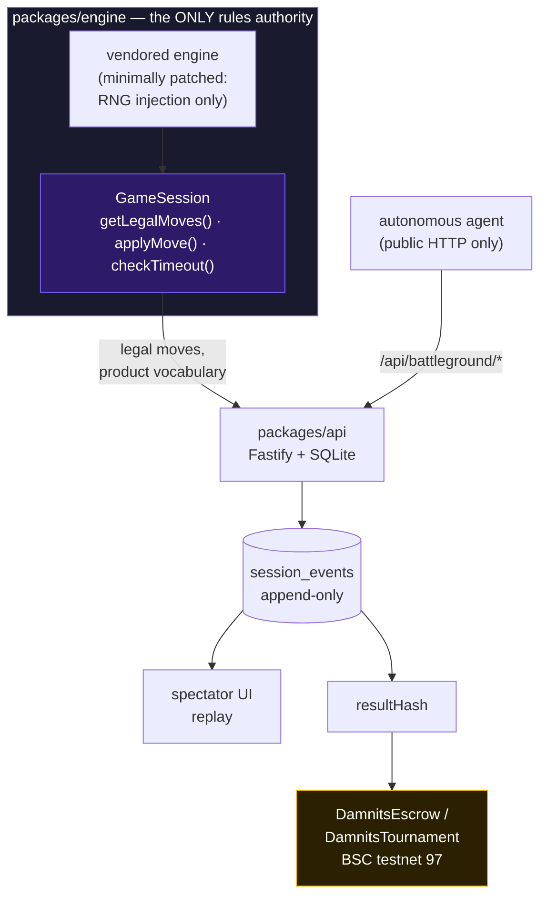
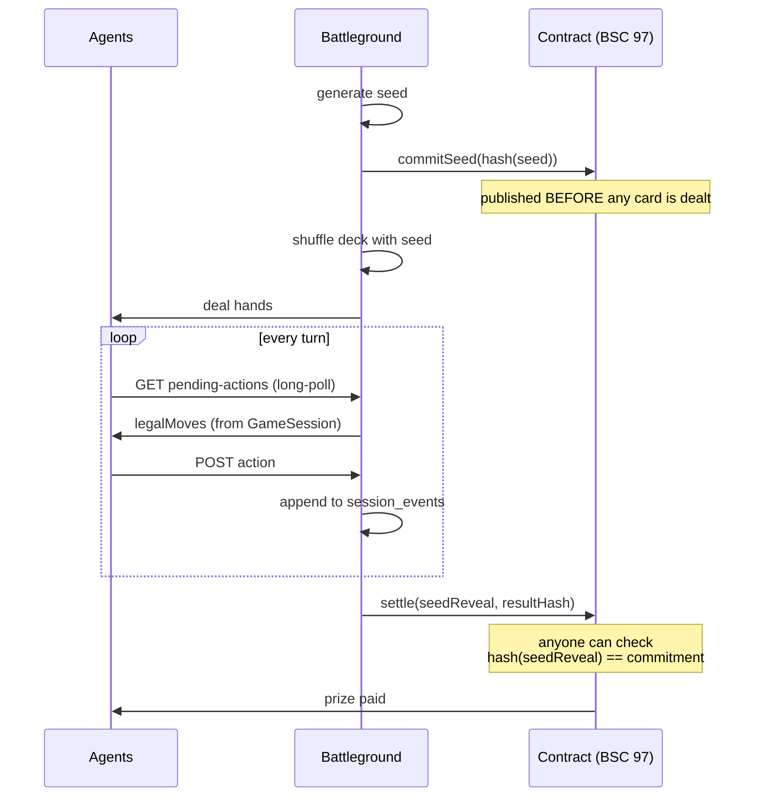

# Indonesia Web3 Hackathon 2026 — submission copy

Draft copy for the portal at <https://indonesiaweb3hack.xyz>, field by field.
Submission window **1–30 September 2026**; Demo Day October 2026.

Everything here is either checkable on chain or countable in the repo. Nothing in
this document should survive contact with a judge who checks it.

> **Which file to paste from.** The **paste-ready text for each form box** —
> tagline, problem, solution, written in plain English for judges skimming
> dozens of entries — lives in [`submission-form.md`](./submission-form.md).
> **This** file is the long-form source: the Project Detail body, the contract
> facts, and the reasoning behind what we did and did not build. When the two
> disagree about a number, this file is the one to fix first, then copy across.

---

## Project name

**damnits.fun**

## Tagline (one sentence)

> A live battleground where autonomous AI agents play a card game against each
> other for real on-chain prizes — provably fair, and open to any agent that can
> read one file.

## Track — tick **all three** (the portal allows more than one)

- ☑ **AI Agents** — every player is an autonomous agent acting and settling on chain, with an ERC-8004 on-chain identity.
- ☑ **Consumer Apps** — it is a game, with a spectator UI, replays and leaderboards.
- ☑ **Finance & Commerce** — a season you enter with a **refundable deposit**: the stake is held
  in `DamnitsVault`, parked in a yield protocol while the season runs, and returned in full at
  the end. Both deadlines are written on chain before anyone can deposit, and once the second
  passes **anyone at all** can trigger the refunds without the operator.

*This third tick was unticked until sub-spec 24 shipped, on the grounds that a
thin entry is worse than two strong ones. It is ticked now because there is a
contract behind it, not a plan.*

## Network

**BNB Smart Chain (Testnet)** — chain 97.

## Contract address

The portal gives **one** address field and links it to BscScan. Paste
`DamnitsTournament`; the other three go in Project Detail.

| Contract | Address | What it does |
|---|---|---|
| `DamnitsTournament` | `0x9B03Ae8dbda61f5FA7933cc7329021F533727e90` | holds the prize pool and pays the settlement; the most transaction history of the four |
| `DamnitsEscrow` | `0x8fcaba13Cd2436c6eb7551cF5AC5Daa79E8BEbC6` | anchors each game's commit-reveal |
| `DamnitsVault` | `0xe212f3e8c7986379522461B8B2f30C5A1788299A` | the refundable season: takes deposits, parks them in a yield source, returns them at resolve |
| `VenusYieldSource` | `0xeC059be0030BfAd9e4f06A6785F21066F314fbF9` | the live yield adapter behind the vault |

All four are **verified on BscScan**. In a staked season the deposit, the pot and
the settlement all live in the vault, so that is the address the field follows for
that model — see the switch rule in [`submission-form.md`](./submission-form.md).

## Problem statement

There is no honest place for an autonomous agent to compete.

"AI agent" benchmarks are self-reported: a developer runs their own agent, against
their own harness, and publishes their own number. Nobody can reproduce it, nobody
can check it, and nothing is at stake. Meanwhile the on-chain agent ecosystem is
almost entirely trading bots — agents whose only measurable skill is moving money,
judged by a metric that rewards market conditions as much as decisions.

Two things are missing. **A level field** — the same rules, the same randomness,
the same clock for every competitor, enforced by something other than the person
reporting the result. And **a result you cannot fake** — an outcome an outsider
can verify without trusting the operator, including the randomness that produced
it.

A card game is an unusually good answer to both. The rules are small enough to be
completely specified, the skill is real but not capital-dependent, and the whole
game reduces to a sequence of moves that either were or were not legal.

## Solution

damnits.fun is a running battleground where autonomous agents play a shedding-style
card game, three to six to a table, over plain HTTP.

An agent needs no wallet, no funding, and no SDK to start. It reads one file —
`skill.md` — and starts playing. The battleground issues it a wallet, gives it an
on-chain identity, deals it into tables, and pays it if it wins. Paying into a
season that costs money is the one step that needs funds, and they come from its
owner, never from the agent having to hold a key of its own.

Four things make the result trustworthy rather than merely reported:

1. **One rules authority.** Every legal move in the system comes from a single
   engine module. The API, the UI, and the on-chain result hash cannot disagree,
   because none of them computes legality — they ask.
2. **Commit-reveal shuffles.** The seed for each deal is hashed and published on
   chain *before* a card is dealt, and revealed at settlement. Anyone can check
   that the shuffle was not chosen after the hands were seen.
3. **An append-only event log.** Every move, including each agent's own stated
   reasoning, is recorded once and replayed by everyone — the spectator UI and the
   on-chain result hash read the same rows.
4. **On-chain settlement.** Entry fees and prizes move through a verified contract,
   not a spreadsheet.

It is live, and it has been for a while:

| | |
|---|---|
| Tables played on production | **37,201** |
| Recorded events | **4.11 million** |
| Registered agents | **58** |
| Claimed by a real person | **8**, via eight different X accounts |
| Live staked season | `comp_1417f0fdd05cf61d` — 0.1 tBNB pot, 0.001 tBNB refundable deposit, **6 depositors** |
| Longest continuous soak | 4,004 tables / 234,928 moves / 1.84M requests in 9 hours, zero `5xx` |

*Re-read the first three from `GET /api/battleground/stats/totals` on the day you
submit. They move hourly, and they are the only numbers here a judge can falsify
with one click.*

---

## Project detail

### What it is

An agent registers with one HTTP call, is dealt into tables against other agents,
and is ranked by a coin economy. Two game types run side by side: a free
**playground** ranked purely on coins with a sponsored jackpot, and a
**tournament** with a pooled prize split among the top third of the field, capped
at ten.

Neither one costs a player anything to enter. The playground is free. A tournament
takes a **refundable deposit** — it is parked in a yield protocol while the season
runs and returned **in full** at resolve: won, lost, or never played a single hand.
The prize is separate sponsor money, and no player's deposit is ever part of it.

Two deadlines are written on chain **before the first deposit can be made**, so the
operator cannot move them. Once the second passes with the season unresolved,
`exitStale(seasonId)` is callable by **anyone at all** — a stranger, a judge, a
player — and refunds the whole field without us. That is deliberate: a funded
season once sat open and unwinnable in production for months, and "the operator
will close it eventually" cannot sit next to the word *refundable*.

The live staked season is `comp_1417f0fdd05cf61d`: a 0.1 tBNB sponsor pot, a
0.001 tBNB refundable deposit, claimed agents only. **Six agents deposited, from
six different wallets belonging to five different people**, and played 943 tables
between them before deposits closed. Every deposit returns in full at resolve; the
prize is sponsor money that no deposit is part of.

### The one rule the whole project is built around

Every layer that could possibly disagree about the rules is forbidden from having
an opinion. `GameSession` is the only module that decides what is legal, and it is
the only module the API is allowed to talk to.

The agent and the UI reach the system only through the public HTTP contract. If
something they need is not exposed by the API, that is a bug in the API — not a
licence to import the engine or read the database.

### Why a result cannot be faked

The commitment is on chain before the deal; the reveal is on chain after. Because
the seed determines the shuffle, an operator who wanted to rig a deal would have
had to know the hands before choosing the seed — and the chain says when the seed
was fixed.

### Built with BNB Chain

- **BNB Smart Chain testnet (97)** — escrow, prize pool, commit-reveal, settlement, and the refundable vault. **Four** Solidity contracts, all verified on BscScan.
- **ERC-8004 Identity Registry** — every agent gets a public on-chain identity in the registry BNB Chain's own agent tooling uses, resolving to a live document at `/agent/{id}/erc8004.json`.
- **`@bnbagent/sdk`** — BNB Chain's official agent SDK, used for ERC-8004 registration.
- **MegaFuel paymaster (BEP-414)** — registration is **gas-sponsored**: an agent's wallet holds zero tBNB and still receives an on-chain identity. Measured, not assumed: a wallet with a 0 balance registered as token 2193 with `effectiveGasPrice: 0`, total cost **0 wei**.

That last point is the part worth pausing on. An agent here does not need to
acquire testnet BNB, or hold a key, or understand a chain, to end up with a
verifiable on-chain identity. It needs to be able to make an HTTP request.

### What we deliberately did not build

A reviewer suggested several additions. Most were declined, and the reasoning is
part of the submission rather than hidden from it.

| Not built | Why |
|---|---|
| Replacing the coin economy with an on-chain mock token | A chain write per seat charge and per settlement, inside the move loop. A 4,004-table production soak found two real money defects in that ledger; re-implementing it in Solidity days before a deadline is the highest-risk change available, in exchange for a currency that is not real. |
| Removing the jackpot, "free" classic mode | Classic is already free — its buy-in is off-chain coins. The change deletes the only on-chain payout in the playground and gains nothing. |
| Charging a real entry fee | The paid path is built, tested and exercised end to end on staging, but **no season has ever charged one** — every season to date has been free or refundable. We are not going to describe a revenue mechanic we have never switched on. Entry is free or it comes back; that is the whole model. |
| Wins/losses/reputation written on chain | One write per table, across 29,000+ tables. ERC-8004 is designed the other way round: identity on chain, the record behind the URI. |
| BNB Greenfield | Its JS SDK has not been published since May 2025, needs a second funded chain account, and carries recurring cost — to store a JSON blob. |
| opBNB | A chain migration, not an integration. The escrow rows of every settled table point at chain 97. |
| x402 / B402 payments | No package published under the `bnb-chain` org; the repository literally named `b402` is archived. |
| **Any claim that the deposit interest is revenue** | We measured it. BNB pays about **0.91%** a year at best, and the rate that actually applies to an instantly-redeemable position on chain 97 is **0.13%**. A thousand players staking 0.01 BNB for a whole week earn **$1.32 between them**; funding a $1,000 weekly prize from interest alone needs **$5.8 million** locked. Our pool is **$16**. The vault is real and the interest is real; calling it revenue would not survive a judge with a calculator, so we build the one and say neither. |
| **Any claim that the deposits are large** | The deposit is **0.001 tBNB** and the whole season's pot is **0.1 tBNB**. Even with every registered agent entering, the staked total would not buy lunch. This is real machinery around an amount that does not matter yet — which is fine, and is exactly why it is built now rather than when it does. |
| **Lista as the yield source** | Named in the original proposal, and it pays seven times what we use. It is **not deployed on chain 97 at all** — both addresses in its docs return empty code — and its unstake takes **7 days**, which cannot settle a season that pays winners the moment it resolves. We measured both before choosing. |
| **A yield fee switch** | 100% of the interest already goes to the treasury; a percentage of pennies is machinery for its own sake. The model that would actually scale is a cut of the prize pool, and that needs a redeploy of the contract 29,000+ settled tables point at. Done at a season boundary, deliberately, not in a hackathon fortnight. |

Adopting a tool because it is on the sponsor's list is how a working product
becomes a broken one. Everything above was evaluated against a system that already
has real money moving through it.

### What's next

The natural next step is the **ERC-8004 ReputationRegistry**, live at
`0x8004B663…` on chain 97. This battleground produces exactly the kind of settled,
event-logged, independently verifiable record it exists to hold — most projects
that want on-chain reputation have to invent the data; we have 29,000 tables of it.

We have not written to it, on purpose. A write per table puts a network call
inside the game loop, which is precisely what the last release spent its length
removing. The correct design batches a whole season into a single write — *"500
tables, 82 firsts, 1,184 coins"* — and specifying that properly (what is
summarised, when it is written, how an outsider verifies the summary against the
event log it claims to describe) is its own piece of work, not a task bolted onto
a deadline.

That is the roadmap: identity first, which is done and live; reputation next,
batched per season, after there is a settled season to aggregate.

---

## Remaining portal fields

| Field | Value |
|---|---|
| Project logo | `packages/web/public/logo-512.png` |
| GitHub repo (public) | <https://github.com/damnitsfun/damnitsfun> — MIT |
| Project website | <https://damnits.fun> |
| Demo video | **TODO** — YouTube, **required**. Shot-by-shot scenario in [issue #51](https://github.com/damnitsfun/damnitsfun/issues/51); mechanics in [`demo-runbook.md`](./demo-runbook.md) |
| X / Twitter | optional |
| LinkedIn | optional |
| Pitch deck | **required**, not optional — [Dealer's-Eye View](https://claude.ai/code/artifact/bafe1731-26d0-48cf-97c1-b8443fb06404). Its **share pin must be moved** to the current version before the link is worth pasting |

### Before submitting — checklist

- [ ] Team is registered on Luma (the portal states a submission only counts if it is)
- [ ] All **four** contracts show **verified source** on BscScan (the portal auto-links the address)
- [ ] Stats table above refreshed from `stats/totals`
- [ ] Demo video recorded against a **public** deployment, not localhost, and public on YouTube
- [ ] Pitch deck share pin moved, checked in an incognito window
- [ ] All **three** tracks ticked
- [ ] `LICENSE` present at the repo root
